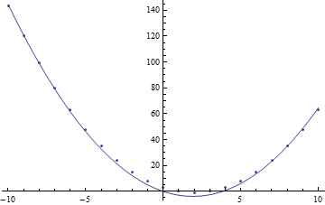
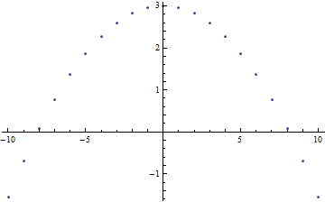
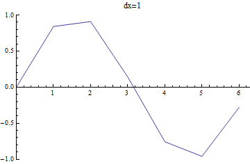
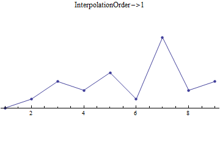
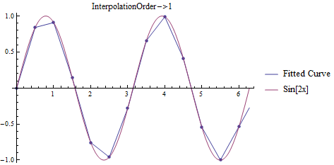

Curve Fitting
=============
To best learn about the curve fitting process, we'll go through a contrived example to
show some of the relevant *Mathematica* features, then describe how the functions
work and how to apply them in a lab scenario, introducing other useful mathematical
constructs along the way to help you analyze your data.
s
Example
-------
One part of analyzing data that is frequently useful is where we have some set of
data and a model to which we believe it corresponds. Then, we can have *Mathematica*
find a fit for the data based on the model. For an example of how this works,
let's sample points from :math:`(x-2)^2-1=x^2-4x+3`, then have *Mathematica* fit
this (incorrectly) to :math:`ax^2+bx`:

::

	t = Table[{x, (x - 2)^2 - 1}, {x, -10, 10}];
	fn[x_] := a x^2 + b x
	fit = FindFit[t, fn[x], {a, b}, {x}];
	fn[x] /. fit
	Show[ListPlot[t], Plot[fn[x] /. fit, {x, -10, 10}], PlotRange -> All]

prints

::

	-4. x + 1.04559 x^2

and plots

	Plot of data from :math:`f(x)=(x-2)^2-1` plotted against fitted curve for 
	:math:`g(x)=ax^2+bx`.

Residuals
---------
It is not immediately clear that this fit is bad (although if we calculated the :math:`R^2`
statistical value, we would have a better indication than just the graph). So, one important
thing to always do is to view the residuals of the fit. If we have a point in the dataset
:math:`(x_i, f_i)`, and fitted function :math:`\hat{f}`, the fitted value at :math:`x_i`
is simply :math:`\hat{f}(x_i)`. Then, the residual is the difference between data and
fitted values :math:`f_i-\hat{f}(x_i)`. If we plot this versus our independent variable

::

	r = Table[{t[[i, 1]], t[[i, 2]] - fn[t[[i, 1]]] /. fit},
	{i, 1, Length[t]}];
	ListPlot[r]

we can see if any kind of pattern arises (again, a visual inspection, but a useful one 
nevertheless - we'll add statistics momentarily):

	Residual plot for data and fitted curve.

Here, we see that there is indeed a clear pattern to the residual plot (a parabola). Recall
that we didn't fit the correct function, so we might expect the residuals to follow some
sort of predictable distribution that accounts for the difference between actual function
and the one fitted.

Least-Squares Fitting
----------------------
*Mathematica* performs what is known as a least-squares fit of the data when applying
the :code:`FindFit` function. In short, using the notation above, a least-squares fit
is one that creates a function such that the following quantity is minimized:

.. math::

	\sum_{i=1}^Nr_i^2=\sum_{i=1}^N\left(f_i-\hat{f}(x_i)\right)^2

But minimizing a quantity means finding a critical point, which we can do by noting that
the derivative of the quantity above is 0 with respect to all coefficients that are being
fitted. So, if the function to be fitted is a function of :math:`M` coeffiencents
:math:`\{c_j\}`, we have that:

.. math::

	\forall{j\in[1,M]}:&\\
	0&=\sum_{i=1}^N2r_i\frac{dr_i}{dc_j}\\
	&=\sum_{i=1}^N2r_i\frac{d\left(f_i-\hat{f}(x_i)\right)}{dc_j}\\
	&=-2\sum_{i=1}^N\left(f_i-\hat{f}(x_i)\right)\frac{d\hat{f}(x_i)}{dc_j}

We know the function we are trying to fit, and have the data. Thus, we have
everything we need to be able to solve this, presuming that we can then solve
the resulting equations for all the coefficients.

.. admonition:: Least-Squares Worked Example
	:class: note

	For an example, let's take the data :download:`here <data/least_squares.csv>`.
	Go ahead and import it using the techniques described in the
	`Import <../Mathematica/import.html>`_ section, then plot the data.
	You should see 6 points that look linear. Let's assume the function
	is :math:`ax+b`. Let's see what our equation above tells us.
	:math:`\frac{d\hat{f}(x)}{da}=x,~\frac{d\hat{f}(x)}{db}=1`. So,

	.. math::

		0&=\left(3.11431-(0a+b)\right)*0+\left(8.14437-(a+b)\right)*1 +
				\left(13.2145-(2a+b)\right)*2\\
		&+\left(18.2655-(3a+b)\right)*3+\left(23.2041-(4a+b)\right)*4 +
				\left(28.3593-(5a+b)\right)*5\\
		{\textrm{and}}&\\
		0&=\left(3.11431-(0a+b)\right)+\left(8.14437-(a+b)\right) +
				\left(13.2145-(2a+b)\right)\\
		&+\left(18.2655-(3a+b)\right)+\left(23.2041-(4a+b)\right) +
				\left(28.3593-(5a+b)\right)

	If we combine terms in each equation, we arrive at:

	.. math::

		0&=-55(-5.8906+a+0.272727b)\\
		0&=94.3021-15a-6b

	This is the equation described by:

	.. math::

		\left(\begin{array}{cc}
		1 & 0.272727 \\ 15 & 6 \end{array}\right)
		\left(\begin{array}{c}
		a \\ b
		\end{array}\right)=
		\left(\begin{array}{c}
 		5.8906 \\ 94.3021
		\end{array}\right)

	We can then compute the inverse of the coefficient matrix in whatever way we find 
	convenient to arrive at:

	.. math::

		\left(\begin{array}{c}
		a \\ b
		\end{array}\right)=
		\left(\begin{array}{cc}
		1 & 0.272727 \\ 15 & 6 \end{array}\right)^{-1}
		\left(\begin{array}{c}
		5.8906 \\ 94.3021
		\end{array}\right)=
		\left(\begin{array}{c}
		5.04159 \\ 3.11305
		\end{array}\right)

	Which, within rounding, is exactly what we get by running

	::

		table = Import["least_squares.csv"];
		fn[x_] := a x + b
		fit = FindFit[table, fn[x], {a,b}, x]

	However, if we take a residual plot, we see that the value of the residual
	generally increases with :math:`x`. Might we have missed something? What about
	trying instead :code:`fn[x_]:=a x ^2 + b x + c`? Running the fitting function on that:

	::

		fn[x_]:=a x ^2 + b x + c;
		fit = FindFit[table, fn[x], {a, b, c}, x]

	gives us the fit :code:`{a -> 0.00178178, b -> 5.03267, c -> 3.11901}`. And in fact,
	this is closer in form to how the data was created:

	::

		Table[{x, 0.01 x^2 + 5 x + 3 + RandomReal[]/3}, {x, 0, 5}]

	Using the first fitting function (just :math:`ax+b`), the sum
	:math:`\sum_{i=1}^Nr_i^2` is 0.008344. Using the second, this is 0.008226.
	The improvement is certainly slight. We might be tempted to go to a higher
	order polynomial:

	::

		fn[x_]:=a x ^ 5 + b x ^4 + c x ^ 3 + d x ^ 2 + e x + f;
		fit = FindFit[table, fn[x], {a, b, c, d, e, f}, x]

	gives astonishingly good results for
	:code:`{a -> -0.155636, b -> 5.08982, c -> 3.11431, d -> 0.131463, e -> -0.0393806, f -> 0.0037974}`
	with the sum of squared residuals being :math:`3.24\times10^{-28}`! But how can this be?
	We added random errors to the data, so how could the sum of the squared residuals
	be so small? Well, since we only have :math:`N=6` points, we can fit a polynomial
	of degree :math:`(N-1)=5` exactly. That's great, but doesn't actually let us know
	about the real underlying function (the original parameters are now radically different
	than before). The shape of the function is totally different outside the range of
	the data. This makes *extrapolation*, using the function to predict values outside
	the range, very difficult and inaccurate. However, the over-fitting function may
	be able to predict values within the range very well - it exactly predicts the values
	provided in the data. Thus, it may be good at *interpolation*. In principle, we benefit
	most from knowing (or approximating) the actual function at work, rather than
	just focusing on finding any function that best fits our data.

The FindFit Function
--------------------
We've used it multiple times already, but the :code:`FindFit` function is extremely useful
and works with pretty much any form of function. For example, we could try to fit an
exponential function :math:`f(t)=Pe^{rt}` or sinusoidal :math:`g(t)=A\cos(\omega{t}-\phi)`.
But, we can do even better. In the examples above, we showed a function of a single
variable, and treated it as a set of points :math:`\left(x_i,~f(x_i)\right)`. But,
we can have more complicated functions by providing points such as
:math:`\left(x_i,~y_i,~f(x_i,~y_i)\right)`. Let's label things a little more consistently.
Let's say we have a function :math:`f(\overline{v})` where
:math:`\overline{v}=\{v_1, v_2, ..., v_n\}` is a vector representing the values of the
:math:`n` variables for the function. And furthermore, let's say that the function is
based on :math:`m` parameters :math:`\{c_1, c_2, ..., c_m\}`. We have the data
for specific values of :math:`\overline{v_i}` as entries read as
:math:`data_i=\{v_{1,i}, v_{2,i}, ..., v_{n,i}, f\left(v_{1,i}, v_{2,i}, ..., v_{n,i}\right)\}`.
Then, the function is

::

	FindFit[data, f[v_1, v_2, ..., v_n], {c_1, c_2, ..., c_m}, {v_1, v_2, ..., v_n}]

where in this form, each :code:`v_i` and :code:`c_i` are listed as symbols, not
numbers. The function will produce a mapping for each :code:`c_i` that best fits :code:`data`.

Sometimes, if one method does not converge on the function, we can try a different one.
For example, providing :code:`Method->NMinimize` as an option. Others can be viewed in the
documentation for :code:`FindFit`.

.. admonition:: Practice Problem: Multivariate Curve Fitting

	Considering the following dataset: :download:`prac_multi.csv <data/prac_multi.csv>`.
	Let the columns represent :math:`(t, x, f(t,x))` for some function :math:`f`.
	Create a 3D point plot of the data - what do you see? When viewed flat on a
	side with the :code:`x` values across the horizontal axis, can you see
	a familiar function for :math:`t=0`? When viewed with :code:`t` on the
	horizontal axis, do we see another function? Some kind of exponential decay?

	Hopefully, from visual inspection, we can see that the function
	:math:`f(t,x)=T(t)X(x)`, in other words, that the function is separable.
	Guess at a function :code:`f[t_,x_]` with two coefficients :code:`k,r` (one
	for each separated function). Try to find the fitting function for
	:code:`k, r`. Did :code:`FindFit` converge? How about if we
	try the only other method referenced, :code:`Method->NMinimize`? How does this
	compare with the original data? Does it match perfectly?

	Hint: For the functions to fit, they are very simple, in that if we made
	the substitutions :math:`kx\rightarrow{y},~rt\rightarrow{\tau}`,
	the separated functions would be an elementary function that is
	parameterized by the single associated variable (:math:`y` or :math:`\tau`),
	with no other numbers to guess, such as :math:`\tan(y)\tau^{-1}`.

Interpolation
-------------
The :code:`FindFit` function is great when we have a model, and in practice, this is
often the case. However, one other method we can use is interpolation. This is a process
where we find a function (perhaps a piecewise one) that fits our data, to approximate
values within the range of our data. For example, we could draw a straight line
between points. This sounds like it could be hazardous in representing
the data, but this does depend on how close together the data is
and how precise we need to be, as seen in the following:

	:math:`\sin(x)` as sampled with different intervals between points.

Mathematically speaking, when we take this straight line fit on :math:`N`
points, we create :math:`N-1` line segments that start at one point, then
go to the next. We could, of course, create :code:`N-2` sections, creating a quadratic
fit based on the current point and next two points, then plotting that
from the current point to the next. We can do this all the way up to a single section
that is a fit of order :math:`N-1`, which will be everywhere smooth and differentiable.
As an example, see the following:

	Data fitted at different values for :code:`InterpolationOrder`

We'll look at how to do these fits in *Mathematica* shortly, but first, we can look at
the math behind the fitting functions. If we take the "interpolation order" to be
the order of the fit between points and represent it by :math:`m`, we create a polynomial
using points :math:`x_i,~x_{i+1},~...,~x_{i+m}` (in the single-variable case - these
functions and processes generalize) of order :math:`m`:

.. math::

	f_i(x)=a_{i,0}x^0+a_{i,1}x^1+a_{i,2}x^2+\cdots+a_{i,m}x^m

If we have the data for each point :math:`\left(x_i,~y_i\right)`,
with :math:`m` points, we can
solve for the coefficients using

.. math::

	\sum_{j=0}^ma_{i,j}x_{i+k}^j=y_{i+k},~k\in[0,m]

or, more usefully,

.. math::

	\left(\begin{array}{ccccc}
	x_i^0 & x_i^1 & x_i^2 &  & x_i^m \\
	x_{i+1}^0 & x_{i+1}^1 & x_{i+1}^2 & \cdots & x_{i+1}^m \\
	x_{i+2}^0 & x_{i+2}^1 & x_{i+2}^2 & & x_{i+2}^m\\
	  & \vdots & & \ddots & \vdots \\
	x_{i+m}^0 & x_{i+m}^1 & x_{i+m}^2 & \cdots & x_{i+m}^m
	\end{array}\right)
	\left(\begin{array}{c}
	a_{i,0} \\ a_{i,1} \\ a_{i,2} \\ \vdots \\ a_{i,m}
	\end{array}\right)=
	\left(\begin{array}{c}
	y_i \\ y_{i+1} \\ y_{i+2} \\ \vdots \\ y_{i+m}
	\end{array}\right)

With this formulation, we can invert the square matrix and compute the coefficients:

.. math::

	\left(\begin{array}{c}
	a_{i,0} \\ a_{i,1} \\ a_{i,2} \\ \vdots \\ a_{i,m}
	\end{array}\right)=
	\left(\begin{array}{ccccc}
	x_i^0 & x_i^1 & x_i^2 &  & x_i^m \\
	x_{i+1}^0 & x_{i+1}^1 & x_{i+1}^2 & \cdots & x_{i+1}^m \\
	x_{i+2}^0 & x_{i+2}^1 & x_{i+2}^2 & & x_{i+2}^m\\
	  & \vdots & & \ddots & \vdots \\
	x_{i+m}^0 & x_{i+m}^1 & x_{i+m}^2 & \cdots & x_{i+m}^m
	\end{array}\right)^{-1}
	\left(\begin{array}{c}
	y_i \\ y_{i+1} \\ y_{i+2} \\ \vdots \\ y_{i+m}
	\end{array}\right)

In the linear case (:math:`f_i(x)=a_{i,0}+a_{i,1}x`), this gives:

.. math::

	\left(\begin{array}{c}
	a_{i,0} \\ a_{i,1} 
	\end{array}\right)=
	\left(\begin{array}{c}
	\frac{x_{i+1}y_i-x_iy_{i+1}}{x_{i+1}-x_i}\\
	\frac{y_{i+1}-y_i}{x_{i+1}-x_i}
	\end{array}\right)

We can plot the function :math:`f_i(x)` over the domain :math:`x\in[x_i,x_{i+1}]`,
then repeat this process for each other segment, giving a function

.. math::

	f(x)=\left\{\begin{array}{ccc}
	f_1(x) & & x_1\leq{x}<x_2\\
	f_2(x) & & x_2\leq{x}<x_3\\
	& \vdots & \\
	f_i(x) & & x_i\leq{x}<x_{i+1}\\
	& \vdots & \\
	f_{n-m}(x) & & x_{n-m}\leq{x}\leq{x_n}
	\end{array}\right.

In *Mathematica*, there are several related functions for interpolation, the one
that is most related to the discussion above being, conveniently, :code:`Interpolation`.
:code:`Interpolation` takes the data, either as
:code:`{{x1, f1}, {x2, f2}, ..., {xn, fn}}`, or
:code:`{{{x1, y1, ...}, f1}, {{x2, y2, ...}, f2}, ..., {{xn, yn, ...}, fn}}`
and produces a regular function in the number of variables given (the default
interpolation order is 3, but easily changed as seen below). For example,

::

	t = Table[{x, Sin[2x]}, {x, 0, 2 Pi, .5}];

	(*Creates single-variable function, given order i*)
	fn = Interpolation[t, InterpolationOrder -> i]

	(*Code for each frame below*)
	Show[
		ListPlot[t, PlotStyle -> PointSize[Medium]],
		Plot[
			{fn[x], Sin[2x]},
			{x, 0, 2 Pi},
			PlotLegends -> {"Fitted Curve", "Sin[2x]"}],
		PlotRange -> {{0, 2 Pi}, {-1, 1}},
		PlotLabel -> "InterpolationOrder->" <> ToString[i]]

	Plots for fitting data to :math:`f(x)=\sin(2x)`.

We can also use :code:`InterpolatingPolynomial[data, {var1, ...}]` to do this, which
will create a single polynomial (degree :math:`N-1` where :math:`N` is the number of 
points in our dataset in the single variable case) defined in terms of the variables
given. In other words,

::

	f1[x_] := Module[{y}, InterpolatingPolynomial[t, y] /. {y -> x}]
	f2[x_] := Interpolation[t, InterpolationOrder -> Length[t] - 1][x]

represent the same underlying function. The former does all the math in an arbitrary
local variable :code:`y`, then substitutes for :code:`y`, the value of :code:`x`, which could
be symbolic. The latter creates the function of an arbitrary variable of its own, to which
we then apply the argument given to us then return the result.