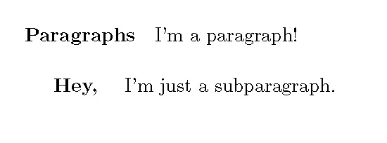

.. role:: raw-html(raw)
   :format: html

==================
Document Structure
==================
LaTeX documents have two main parts: the **preamble** and the **body**.

The preamble is optional, but can make your life much easier. It acts much 
like a style sheet or a header file, allowing you to define things which can 
be called later or import commands without having to define them yourself. 
Here you can define commands, styles and environments which you will later use.

The **body** has the structure and content of the document. This is where 
exposition, lists, figures, and nearly everything else in the document goes.

Document Classes
================
There is one required command for every LaTeX document, :code:`\documentclass{}`. Specifying the class of the document tells LaTeX the basic formatting desired for the document. Very few commands will work before the document class is declared, so it should be done as early as possible. There are many document classes available for LaTeX. Each can be edited heavily, but one must be used as the basis for any document. Below are some of the most common:

.. table:: **Table 1: Document Classes**

    ========= ====================================================================================
    **Class** **Use**
    ========= ====================================================================================
    article   By far the most common document class. Formats the document for use in publications.
    report    For articles that need more structure, especially if they are longer.
    book      Formats the document to be printed as a book.
    letter    Makes very professional-looking letters.
    beamer    A class for creating presentations in LaTeX.
    ========= ====================================================================================

To declare the class of a document to be :code:`article`, use :code:`\documentclass{article}` in the preamble. Document classes also include many options which can be changed when the class is declared. These are optional, and so are declared in the optional argument of the :code:`\documentclass` command. Below, the standard setting for :code:`article` is italicized among some of the other possible options. If you wish to use the default setting, do not bother specifying it.

.. table:: **Table 2: Document Class Options**

    =========== ========================== ====================================================================================
    **Option**  **Possible Settings**      **Description**                                                                     
    =========== ========================== ====================================================================================
    Font Size   10pt, *11pt*, 12pt         The size of standard text                                                           
    Paper Type  a4paper, *letterpaper*     The type of paper for printing                                                      
    Title Page  titlepage, *notitlepage*   Whether to force a new page after the title                                         
    Columns     *onecolumn*, twocolumn     The number of columns in the document                                               
    Page Sides  *oneside*, twoside         Whether the document is intended to be printed single- or double-sided              
    Orientation *portrait*, landscape      How the document is oriented on paper                                               
    Draft       draft                      Makes typesetting problems apparent with a mark in the right margin; disables images
    =========== ========================== ====================================================================================

The order of the options is arbitrary. So a letter with 10 point font on A4 paper to be printed with the landscape orientation is specified with

::

   \documentclass[10pt, landscape, a4paper]{letter}

A more thourough treatment is available on `the LaTeX wikibook <http://en.wikibooks.org/wiki/LaTeX/Document_Structure#Document_classes>`__.

The Preamble
============
Having a preamble is completely optional. However, having a good preamble can 
save a lot of time with formatting. Ideally, it should function like a 
stylesheet for a webpage. The body of the document should have as little 
formatting as possible, made possible by the preamble.

The preamble contains packages, new commands, and formatting information. 
Packages include new commands, environments, symbols, and generally increase the 
functionality of LaTeX far beyond the bare minimum it natively includes. New 
commands make life easier by creating shortcuts for calling symbols and oft-used 
symbol and information patterns. 

Packages
--------
Once LaTeX knows what kind of document you are working in, relevant packages 
should be loaded. The order of packages loaded can matter, particularly if they 
alter some of the same settings. In this case, the package loaded last usually 
gets the final say.

Packages are loaded with the :code:`\usepackage{thepackage}` command. The 
:code:`usepackage` command also takes an optional argument which allows for 
changing some settings on the package. For example, the :code:`geometry` package 
allows margins to be set using this method. If you want your document to have 
margins of 1 inch rather than the default by loading the package with 
:code:`\usepackage[margin=1in]{geometry}`.

More information on packages is included in the `Packages <packages.html>`_ page.

New Commands
------------
New commands are declared with :code:`\newcommand{}{}`, a command which has two 
mandatory arguments. The first argument specifies how the command is called, and 
the second are how LaTeX should interpret the command. Say we like the way 
:math:`\varepsilon` looks better than :math:`\epsilon`, but don't want to have 
to type :code:`\varepsilon` every time. By using 
:code:`\newcommand{\e}{\varepsilon}`, we can create :math:`\varepsilon` by just 
typing :code:`\e`.

The :code:`\newcommand{}{}` also takes an optional argument which specifies the 
number of arguments. More information on new commands is available in the
`New Command <newcommand.html>`_ lesson.

Formatting
----------
Generally, the last part of the preamble should be formatting. Now that packages 
are loaded and new commands have been created, there are many options to fiddle 
with and none will be overridden by loading packages after specifying custom 
formatting. Everything in LaTeX can be customized. Fortunately, specifying the 
document class prevents declaring the base formatting from being necessary. 
Sometimes, packages allow for easier access to formatting, such as creating 
custom list levels and formatting. More information on formatting is in the 
formatting lesson.

Miscellaneous Actions
---------------------
There are many, many more things that can be useful to have in the preamble. 
These include declaring new operators, having an external preamble (to act as a 
stylesheet or collection of common commands for many documents), and even 
creating new environments.

Body
====
The body of a document begins with the :code:`\begin{document}` command and ends 
with the :code:`\end{document}` command. LaTeX treats everything between those
:code:`\begin` and :code:`\end` statements as the :code:`document` environment. 
Make sure to always include these commands - otherwise LaTeX will not typeset 
the document.

As indicated by the way it is called, :code:`document` is actually considered 
an *environment* within LaTeX. See the environments lesson for more 
information. Except comments, everything written the body of a LaTeX document 
will be processed during typesetting.

Sections, Subsections, and Subsubsections, Oh My!
-------------------------------------------------
LaTeX provides many commands which make it easy to organize the body of the 
document using headings. These built-in commands also automatically provide 
content for the table of contents (should you choose to have one).

The table of contents is placed in the document with the command 
:code:`\tableofcontents`. Because of the way LaTeX handles document struture, 
it does not immediately reflect the changes made to the document upon 
typesetting. If you change something and want the table of contents to update 
correctly, just typeset the document twice.

The most common section command is :code:`\section{Section Name}`, with "Section 
Name" replaced with whatever you want the section to be called. These can be 
further divided with :code:`\subsection{}`, and :code:`\subsubsection{}`. For 
document class :code:`article`, these are generally the only ones you will need 
to use. If you are typesetting a :code:`book` or a :code:`report`, there is a 
heading level above section, :code:`\chapter{}`. The largest section heading 
level is :code:`\part{}`, and can be used in nearly any document.

You should start with the highest level your document needs and work your way 
down. For most documents, sections, subsection, and subsubsection will be 
sufficient. 

There are :code:`\paragraph{}` and :code:`\subparagraph{}` commands. They allow 
paragraphs to have titles, and look like this:

::
   
   \paragraph{Paragraphs}
   I'm a paragraph!
   \subparagraph{Hey, }
   I'm just a subparagraph.

Using these commands to specify paragraphs is generally unnecessary since most 
documents don't need to be this structured. A paragraph break can be specified 
by inserting a blank line between paragraphs. If you want to keep the paragraph 
heading styling, but want to start the paragraph on it's own line, just insert 
a new line as so:

::
   
   \paragraph{Another Paragraph} \hspace{0pt} \\
   I started on a new line!

If you want a section/subsection/subsubsection to not have a number, insert an 
asterisk in the command as so: :code:`\section*{Unnumbered}`.

Page Breaking
=============
To start the following material on a new page, the :code:`\newpage` or the :code:`\clearpage` command may be used. :code:`\newpage` starts the succeeding material on the next page, while :code:`\clearpage` typesets all figures and tables before starting a new page. This distinction is required because normally LaTeX calcualtes optimal positions for tables and figures, usually placing them out of sequence with their position in the text, and sometimes pages before or after their location might indicate from the text in the code. So using :code:`\clearpage` ensures all figures and tables are typeset and the succeeding text acts as a coherent block.

If creating a double-sided document, it can be useful to use :code:`\cleardoublepage`, which acts like :code:`\clearpage`, but waits until the next odd-numbered page to begin typesetting more material. If used on an even-numbered page, this means it just starts on the next page. If used on an odd-numbered page, LaTeX will make the following even page blank, and then begin typesetting material on the next odd page.

Sometimes LaTeX chooses odd places for page breaks. To suggest a better place, use :code:`\pagebreak`. The command takes an optional argument which says how insistent you are that there may be a page break there, with 0 being a slight suggestion and 4 forcing LaTeX to create a new page. Especially in longer documents, using these generously between paragraphs can give you a lot of control over how LaTeX chooses page location. I generally go with :code:`\pagebreak[2]` between paragraphs if I do not want LaTeX to break up any paragraphs across pages.

If there is a place you specifically do not want LaTeX to create a page break, use :code:`\nopagebreak` in much the similar way as :code:`\pagebreak`, as it takes an optional argument from 0 to 4. This can be useful to ensure sets of equations are all set on the same page.

The Bibliography
================

In LaTeX, including a bibliography can be a beast of its own. Even when doing 
it the right way it can be finnicky. It is recommended to start the 
bibliography early and not when you are in a rush. If you are in a 
rush, there are ways to fake it. See the bibliography lesson for more details on 
both.

After the \\end{document}
=========================
Nothing after :code:`\end{document}` is used in the output. Common reasons for 
having code after :code:`\end{document}` include debugging, testing, and 
temporary code storage.

Debugging and Testing
---------------------
Sometimes, LaTeX gives obscure errors and references lines which don't
actually contain errors. This is because LaTeX usually doesn't encounter the
errors until it tries to piece together code, such as at the end of an 
environment, most commonly when writing math.

Putting :code:`\end{document}` inside of an environment does cause an error 
itself. However, LaTeX will have processed all code up to that point so the 
original error will still cause an issue. This is because when LaTeX encounters 
:code:`\end`, it will typeset everything up to that point. If the only error is 
that :code:`\end{document}` is inside an environment, then 
:code:`\end{document}` is before the error. If not, then :code:`\end{document}` 
is after the error. This allows for a line-by-line search to find the bug.

Code Storage
------------
Sometimes there is part of a document that doesn't fit anywhere inside the 
document currently, but might later. Rather than deleting the code or storing 
it somewhere else, placing it after :code:`\end{document}` allows for safe 
storage.

For larger projects, it is a better idea to learn and use version control so 
nothing valuable will be lost.
