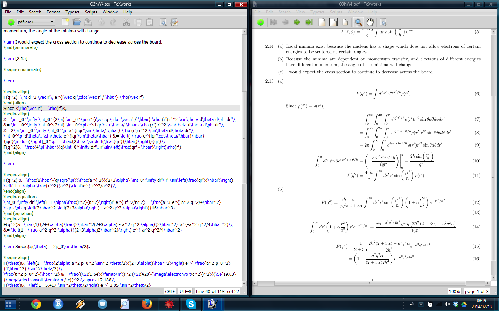

.. role:: raw-html(raw)
   :format: html

============
Installation
============
LaTeX can be a pain to install if done manually. At a bare minimum, you need a LaTeX distribution with which you can interact via the command line. We recommend using a front-end. Having a front-end can make LaTeXing easier by providing more meaningful error messages and presenting the document in a more human-readable format.

For this class, I recommend going with TeXworks. You need to install `TeX Live <http://www.tug.org/texlive/acquire-netinstall.html>`__, then `TeXworks <http://www.tug.org/texworks/>`__. These websites provide some guidance, but if you have any trouble installing or understanding the instructions, email me at willbeason@gmail.com.

TeXworks Features
=================
The reason we chose TeXworks is because it comes with a lot of learner-friendly features. Some of these are not enabled by default, including a spell-check, context-sensitive code highlighting, and automatic indentation. (Indentation is ignored when typesetting, but it can make your code more readable.) There are many options you can adjust with Edit -> Preferences.... I like to enable Line numbers, set Syntax coloring to LaTeX, Whitespace only auto-indentation, and enable English spellchecking. Line numbers are particularly useful since error codes refer to the line number where the typesetting program ran into a problem (not necessarily where the error is, but always after it).

Side-by-Side View
-----------------
Interacting with TeXworks should normally look like this, with code and current document side-by-side.

When starting a new document, TeXworks does not automatically do this. Once you have a minimum valid document, typeset and your environment should look like the above. To typeset, either push the green arrow at the top-left corner or use the keyboard shortcut Ctrl-T.

Errors
------
One intimidating feature of LaTeX is its error codes. Sometimes they can be cryptic and point to things that aren't actually wrong. Some simple ones will be covered later. It is important to remember that LaTeX will throw the error message when it runs into a problem while typesetting, not necessarily in the same line as where the error in the code is.

Error codes appear in :code:`Console output` while typesetting. Normally, this flashes on screen, a bunch of code flies by, and it disappears. If it didn't, usually it means something went wrong.

Consider this code and error message:

:: 
   
   Runaway argument?
   {enumerate 
   ! Paragraph ended before \begin was complete.
   <to be read again> 
   \par 
   l.17 
        
   ? 

It references line 17 (l.17). The words :code:`Runaway argument?` mean that LaTeX was trying to finish a control sequence but never finished getting input. As shown in the second line of the error, :code:`{enumerate` is missing a closing curly brace (a necessity for all arguments of commands). In this case, the error was actually on line 16, and line 17 was blank. The line currently reads :code:`\begin{enumerate` when it should read :code:`\begin{enumerate}`. LaTeX didn't realize there was a problem until a new line started.

Unfortunately, LaTeX sometimes doesn't even realize there is a problem until it reaches the end of the document, givin unhelpful messages such as

::
   
   Runaway argument?
   { \par \par Create a document which meets the following description. \ETC.
   ! File ended while scanning use of \@xdblarg.
   <inserted text> 
   \par 
   <*> Assignment6.tex
                      
   ? 

One way to troubleshoot this is with :code:`\end{document}`, and this method is covered in the Document Structure lesson.

Document-Code Navigation
------------------------
Let's say you're looking at the pdf on the right side, and want to know what code made some part of the document. Rather than having to piece through the document, you can just right click the object in the pdf, then click "Jump to Source". If you want to see what a line of code produces, right click the code, then click "Jump to PDF". Note that since the relationships between code and pdf are made as the document is typeset, if you change the document after typesetting then some of the relationships will be wrong.

Templates
---------
Unlike many LaTeX front-ends, making templates for easy re-use is simple. Just save the .tex file in the appropriate folder, listed below. The template is accessible from the menu with File -> New From Template....

Windows - C:\Users\<username>\TeXworks\templates\Basic LaTeX documents\

Mac - 	~/Library/TeXworks/templates/Basic LaTeX documents/

Linux - ~/.TeXworks/templates/Basic LaTeX documents/

Removing Aux Files
------------------
Sometimes, LaTeX hiccups and your .aux files can become corrupted. If this is the case, just do File -> Remove Aux Files... and select the offenders.

