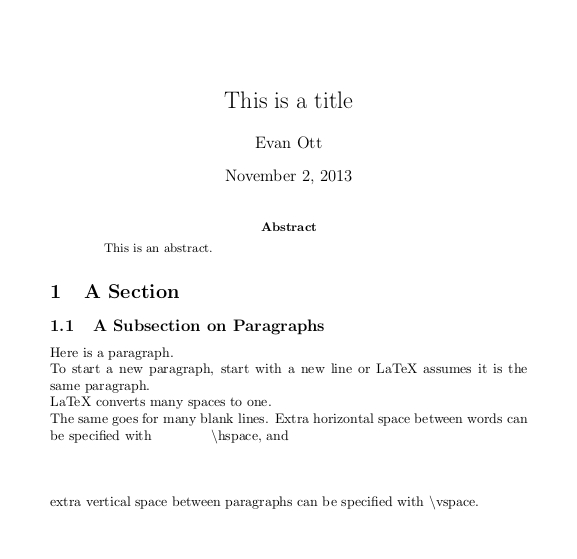

==============================
LaTeX
==============================
Introduction (What's a LaTeX?)
==============================
LaTeX ("lah-tech" or "lay-tech") is a markup language - one that allows the author to
more precisely (and easily) specify how layout and content are combined. :math:`\LaTeX` (which should
be written that way whenever possible) is based on Turing Award Winner Dr. Donald Knuth's :math:`\TeX`
typesetting system which is:

- Built for a "minimal amount of effort" for the author to produce high-quality documents
- Totally platform- and time-independent for resultant documents

What is Used For?
-----------------
Besides making text look good, :math:`\LaTeX` is for

- Digital and hard-copy media
- Hyperlinks and document bookmarks in PDFs
- High-quality non-rasterized fonts for arbitrary-sized printing
- Embedding vector graphics
- Professional presentations

What Does it Look Like?
-----------------------
:math:`\LaTeX` documents are mostly the text you want to display, with additional information for formatting,
images, and other special features. A simple document looks like the following.

::
   
   \documentclass{article}
   \begin{document}
   Hello World!
   \end{document}

This produces the following document:

::

  \documentclass{article}
  
  \title{This is a title}
  \author{Evan Ott}
  \date{\today}
  \begin{document}
  \maketitle
  \begin{abstract}
     This is an abstract.
  \end{abstract}
  \section{A Section}
     \begin{subsection}{A Subsection on Paragraphs}
        Here is a paragraph.
        
        To start a new paragraph, start
        with a new line or LaTeX assumes it is the same paragraph.
        
        LaTeX        converts              many spaces to         one.
        
        
        
        The same goes for many blank lines. Extra horizontal space between words can be specified with \hspace{0.5in} \textbackslash hspace, and
        \vspace{0.5in}
        
        extra vertical space between paragraphs can be specified with \textbackslash vspace.
     \end{subsection}
   
  \end{document}

Which produces something like

