Functions and Graphing
======================

Functions
---------
We've talked about a data-based way of looking at storage in *Mathematica* with lists, matrices,
tables, etc. But one other form of "storage" we can consider is functions. *Mathematica*
allows us to define functions in a very similar way to how we might write down a function
in mathematics. If we want to define some function :math:`f(x)=x^2+\frac{11}{x}`, we can
simply write:
::

	f[x_] := x^2+11/x

There are some important differences here. The first is the underscore (:code:`_`) character
on the left-hand side that is absent on the right-hand side. That tells *Mathematica* that
the :code:`x` in the function definition is a dummy variable.

.. sidebar:: The Smart Dummy Variable

	As we saw above, we want to define functions with variables with an underscore at the end.
	What happens if we leave that out? Well, we then effectively create different expressions
	based on the variables we use to define the "function". For example:
	::

		f[x] = x^2
		g = 7 * y

	Both "functions" have a unique behavior. 

	:code:`f` applied to anything other than the variable :code:`x` will not be evaluated.
	This is because we only defined the function for the variable :code:`x`. If we try 
	to evaluate :code:`f[x]`, we do get :code:`x^2`. But if instead we first define
	:code:`x=2`, :code:`f[x]` can no longer be evaluated, since :code:`f[2]` is not defined.

	:code:`g` is different still. It is not actually a normal function, but instead a
	substitution expression based on the current value of :code:`y`. If :code:`y`
	is not defined, we can use this as an expression (for example, applying a
	substitution :code:`g/.y->5` to it), but if :code:`y` is defined, then :code:`g`
	is exactly the value :math:`7\cdot{y}`.

	There are further subtleties (the difference between :code:`=` and :code:`:=`, for example),
	but always using the full function definition :code:`func[x_, y_] := \cdots` is the best
	way to go.

We can easily apply functions to other functions as well:

::

	g[x_]:=x/11;
	g[f[x]]

will print:

::
	
	x^2/11+1/x

We can base functions on other functions (built-in or user-created) too. There are many built-in
functions which take functions as arguments.

.. admonition:: Example: Calculus
	:class: note

	One particularly useful realm for user-created functions is taking their integrals and
	derivatives. We can take a derivative :math:`\frac{d}{dx}` of a function :math:`f(x)`
	by using:

	::

		D[f[x], x]

	Where we have defined :code:`f[x_]:= ...`. *e.g.*, :code:`f[x_]:=x^2` will have
	:code:`D[f[x], x]=2x`. Of course, because these are functions of whatever variable
	we apply, we can
	use any variable name we want in the derivative: :code:`D[f[y], y]` = :code:`2y`.

	We can also take integrals (both definite and indefinite), using the same command
	in both cases. To take the indefinite integral, we'll use:

	::

		Integrate[f[x], x]

	That will, for example, given :code:`f[x_]:=x^2`, have
	:code:`Integrate[f[x], x]=x^3/3`. If we'd rather take the definite integral,
	we can use:

	::

		Integrate[f[x], {x, a, b}]

	where :code:`a` and :code:`b` are the limits of integration: :math:`\int_a^bf(x)dx`.

Introduction to Graphing
------------------------
Until this point, we have largely just dealt with numbers and functions. Now, let's take
a look at expressing data more graphically, and how to customize the display for different
scenarios.

Basic 2D Graphs
---------------
First, let's look at graphing functions in two-dimensions, with some basic customization
features. The simplest is :code:`Plot[f[x], {x, a, b}]`, which will plot the function
:math:`f(x)` from :math:`x=a` to :math:`x=b`, with :math:`x` on the horizontal axis
and :math:`f(x)` on the vertical axis, selecting an automatic, appropriate range
for :math:`f(x)`. For example, for :math:`f(x)=\sin(x),~x\in[0, 2\pi]`,
we have :code:`Plot[Sin[x], {x, 0, 2 Pi}]`, which will produce:

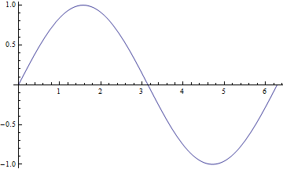

	Simple plot for :math:`f(x)=\sin(x)`.

While we might be able to tell what's going on in the graph above, that's not
always going to be the case. For example, we might want to have some basic labels on the
graph, for the axes and for a title. Turns out, this is very easy to do with our friend from
the
`Evaluating Symbolic Expressions <structure.html#evaluating-symbolic-expressions>`_
section, the rule operator (:code:`->`). Many functions allow for optional arguments
using the name of the argument and the rule operator to the desired value. For example,
with the :code:`Plot` function above, we might want to label axes. We do that with the
:code:`AxesLabel` argument:

::

	Plot[Sin[x], {x, 0, 2 Pi}, AxesLabel->{"x","f(x)"}]

which will create:

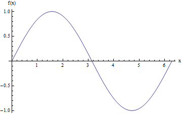

	Plot for :math:`f(x)=\sin(x)`, with labeled axes.

We can further add a title to the graph (:code:`PlotLabel->"My Title"`), define a different
range for the plot (:code:`PlotRange -> {{xmin, xmax}, {ymin, ymax}}`), select the
color and style of the line (:code:`PlotStyle->[Green, Dashed, Thin]` - some colors are
pre-defined, but we can use :code:`RGBColor[red,green,blue]` and
:code:`RGBColor[red,green,blue,alpha]` to create custom colors), and label the functions
we're graphing (:code:`PlotLegends->"Expressions"` - a special option that prints the function
definitions). We can actually plot more than one function at a time too by providing a list
of functions as the first argument (all functions of the same variable). If we do that,
then for the :code:`PlotStyle`, we will find it helpful to provide instead a list of the styles.
So, for example, we could have:

::

	Plot[{Sin[x], Cos[x]},
         {x, 0, 2 Pi},
         AxesLabel -> {"x", "f(x)"} ,
         PlotLabel -> "My Title",
         PlotRange -> {{0, 3 Pi}, {-1.5, 1.5}},
         PlotStyle -> {
            {RGBColor[0.900082, 0.425655, 0.093112], Dashed, Thin},
            {RGBColor[0, 1, 0], DotDashed, Thick}},
         PlotLegends -> "Expressions"]

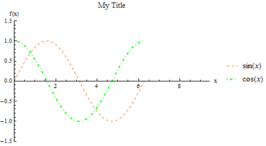

	Plot for :math:`f(x)=\sin(x),~g(x)=\cos(x)`, with options specified above.

There are several other useful plotting functions for other applications.

:code:`ListPlot` is for plotting specific data in one of two formats. The first is a simple
list of numbers :math:`\{a_1,~a_2,~...,~a_n\}`, assuming that it corresponds to points
:math:`\{(1,~a_1),~(2,~a_2),~...,~(n,~a_n)\}`. The second (often more useful)
is a set of points :math:`\{(a_1,~f(a_1)),~(a_2,~f(a_2)),~...,~(a_n,~f(a_n))\}`.
As we saw in the section on `Tables <lists.html#tables>`_, we can easily create lists of points
(which are just 2-element lists), with :code:`Table[{i, f[i]}, {i, imin, imax}]`.
So, for example, we can have:

::

	 ListPlot[Table[{i, Sin[i^2/1000]}, {i, 0, 200}]]

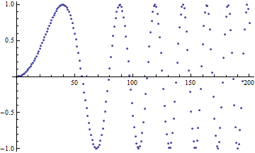

	Plot of :math:`\sin\left(\frac{x^2}{1000}\right)`.

Like with the :code:`Plot` function, we can have many lists of points as the first argument to
the function. For a more interesting example:

::

    list = Table[Table[{a, a^2 + 50 Sin[c*a]}, {a, 0, 20}], {c, 0, 3}];
    ListPlot[list, 
        PlotLegends -> {"data 1", "data 2", "data 3", "data 4"}, 
        PlotStyle -> PointSize[Medium] (*Makes points bigger*)]

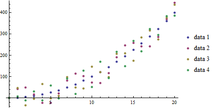

	Plot of functions :math:`f_c(a)=a^2+50\sin(c*a)` over :math:`a\in[0,20],~c\in[0,3]`.

With the :code:`ListLinePlot` function, we get all the features of the :code:`ListPlot`,
but with consecutive points connected:

::

    ListLinePlot[list, 
        PlotLegends -> {"data 1", "data 2", "data 3", "data 4"}]

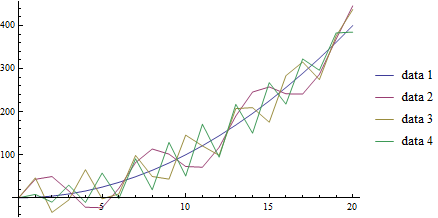

	Plot of functions :math:`f_c(a)=a^2+50\sin(c*a)` over :math:`a\in[0,20],~c\in[0,3]`.

This is nice, but here we have another option at our disposal, :code:`InterpolationOrder`.
If this is greater than 0, *Mathematica* will apply a smoothing fit to the data (in practice,
2 gives a reasonable fit, and above 8 makes little visual difference):

::

    ListLinePlot[list, 
        PlotLegends -> {"data 1", "data 2", "data 3", "data 4"}, 
        PlotStyle -> Thick,
        InterpolationOrder -> 4]

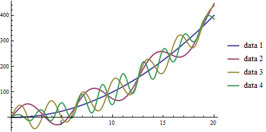

	Plot of functions :math:`f_c(a)=a^2+50\sin(c*a)` over :math:`a\in[0,20],~c\in[0,3]`.

Other function plotters are applicable to other formulations. For example, we can have
polar plots of the form :math:`r(\theta)=\cdots` with the :code:`PolarPlot` function:

::

    PolarPlot[{Cos[3 t], -Cos[3 t]}, {t, 0, 10}, PlotStyle -> {Blue, Red}]

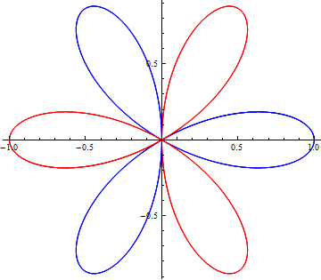

	Plot of functions :math:`r_1(\theta)=\cos(3\theta),~r_2(\theta)=-\cos(3\theta),`
	over :math:`\theta\in[0,10]`.

:code:`ParametricPlot` accepts pairs of functions that together describe points. For
example, we might have :math:`x(t)=\cos(t),~y(t)=\sin(t)`. We can plot that easily:

::

	ParametricPlot[{Cos[t], Sin[t]}, {t, Pi/4, 7 Pi/4}]

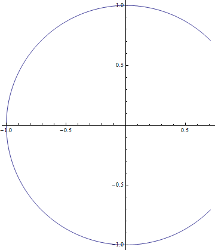

	Plot of :math:`x(t)=\cos(t),~y(t)=\sin(t);~t\in[\pi/4,~7\pi/4]`.

We can have multiple pairs of functions, as with other plotting functions above, but
one extra feature we have is to actually have two-parameter functions, plotting over both.
Using a slightly modified example, :math:`x(t,~u)=u\cos(t),~y(t,~u)=u\sin(t)`, we can
obtain plots like:

::

	ParametricPlot[{u Cos[t], u Sin[t]}, {t, Pi/4, 7 Pi/4}, {u, 7, 10}]

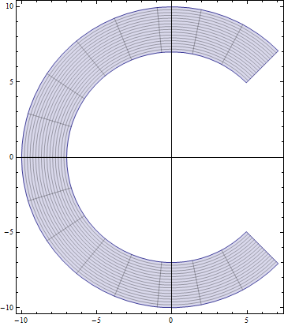

	Plot of :math:`x(t,~u)=u\cos(t),~y(t,~u)=u\sin(t);~t\in[\pi/4,~7\pi/4],~u\in[7,10]`.

We have the :code:`ContourPlot`, which has a few variants, each based around the
idea of finding level curves of functions of two variables. If you have ever used a
topographical map while hiking, this will seem familiar. For an example, let's start with
a simple, not-so-interesting function :math:`f(x,~y)=(x-1)^2+(y+2)^2`. That has a vertex
centered at :math:`(1,~-2)`, but grows radially outward from there:

::

	ContourPlot[(x - 1)^2 + (y + 2)^2, {x, -5, 5}, {y, -5, 5}]

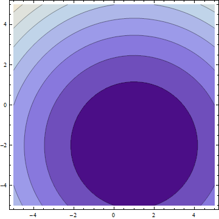

	Plot of :math:`f(x,~y)=(x-1)^2+(y+2)^2;~x,y\in[-5,5]`.

In the default form, at least, this is largely uninteresting, just showing that the function
grows bigger as it deviates from :math:`(1,~-2)`. But, if we apply some more information, we
can get customized information. In a moment, we'll look at 3-dimensional graphs, which will
help to visualize the actual function, but let's now take 
:math:`f(x,~y)=|\sin(x)\sin(y)|`. We should expect peaks of this function wherever both
:math:`\sin(x)` and :math:`\sin(y)` are at their extrema (:math:`-1,~1`),
since in all other cases, :math:`f` will be less than :math:`1`. But we know that
:math:`\forall{x,y}:f(x,~y)\in[0,~1]` (that notation means
"for all x and y, f is in that range"),
so why don't we see, for example, where :math:`f` is some specific values:

:: 

    f[x_, y_] := Abs[Sin[x] Sin[y]]
    ContourPlot[
      {f[x, y] == .005,
      f[x, y] == .05,
      f[x, y] == .25,
      f[x, y] == .45,
      f[x, y] == .65,
      f[x, y] == .85,
      f[x, y] == .95},
     {x, -2 Pi, 2 Pi},
     {y, -2 Pi, 2 Pi},
     PlotLegends -> "Expressions"]

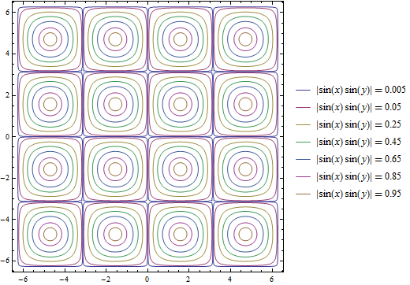

	Plot of :math:`f(x,~y)=|\sin(x)\sin(y)|;~x,y\in[-2\pi,2\pi]`.

One other plot that is also interesting is the :code:`RegionPlot`. This plot does not
take a function, but rather a conditional expression. If true, the point is plotted. If not,
the point is blank. For example:

::

	RegionPlot[Or[Sqrt[x^2 + y^2] <= 10, x^2 > 144],
	  {x, -15, 15}, {y, -15, 15}]

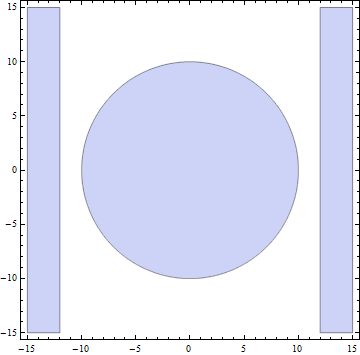

	Plot of the region statisfying either :math:`x^2+y^2\leq{100}` or
	:math:`|x|\geq{12}`.

.. seealso:: Mathematical Logic
	
	On some occasions, we may want to employ logic in addition to more familiar
	functions on real and complex numbers. While likely not needed for this course, it
	may help when dealing with complicated functions or with future programming projects
	in research, industry, and beyond. See the appendix for
	`Mathematical Logic <../Math/logic.html>`_.

It should be noted that all of these graphing functions have other options available, which
can always be found at the
`*Mathematica* Reference <http://reference.wolfram.com/mathematica/guide/Mathematica.html>`_
or using *Mathematica's* help features.

.. admonition:: Business Graphs
	:class: note

	Pie charts, etc.

Basic 3D Graphs
---------------
We can do many of the things we did above in three-dimensional plots as well. The easiest
example is :code:`Plot3D`:

::

	Plot3D[Sin[x y], {x, 0, 2 Pi}, {y, 0, 2 Pi}]

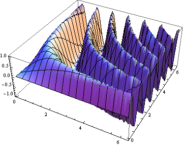

	Plot of :math:`f(x,~y)=\sin(x\cdot y);~x,y\in[0,~2\pi]`

We have many of the same options as in the 3D case. We can label the whole plot with
:code:`PlotLabel`, label the independent variable axes with :code:`AxesLabel`, and set the
colors of graphs with :code:`PlotStyle`. But, we have a few additional options. We can
easily add a gradient to the plot (the default is shown above). The built-in ones can be
created with :code:`ColorFunction->"name"` where :code:`"name"` is one of the elements
seen below.

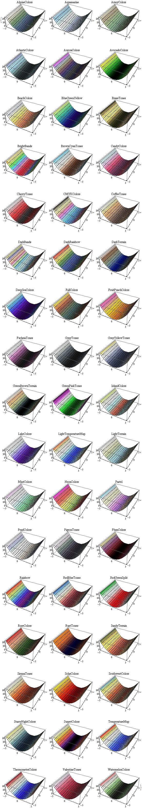

	Colors available for :code:`ColorFunction`.

In those cases, the function is a function of the plotted value only (not of the independent
variables). However, we can create custom color functions by using the :code:`RGBColor` function.
We create a new Function in three variables (the three axes - the first then second independent
axes then the value of the plot at that point, scaled for 
) that involves some other color function,
for example :code:`RGBColor`: 

::

	Plot3D[Sin[x], {x, 0, 2 Pi}, {y, 0, 2 Pi},
	  ColorFunction ->
	  Function[{x, y, z},
	    RGBColor[x, 0, 0]], (*Just produce red colors as a function of x*)
	  AxesLabel -> Automatic]

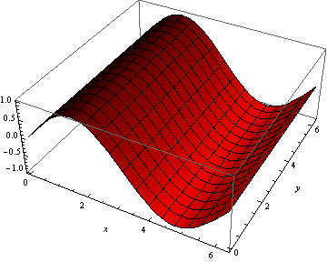

	Plot of :math:`f(x,~y)=\sin(x);~x,y\in[0,~2 Pi]`, with color as a function of :math:`x`.

We can make these as complicated as possible, but generally want to make color easy
to work with if used as a gradient. The built-in functions have built-in plot legends as well:

::

	Plot3D[(x-2)^3 - .5(y-1)^3, {x, 0, 2 Pi}, {y, 0, 2 Pi},
	  ColorFunction -> "BeachColors",
	  AxesLabel -> Automatic,
	  PlotLegends -> Automatic]

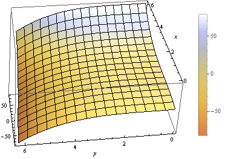

	Plot of :math:`f(x,~y)=(x-2)^3-\frac{1}{2}(y-1)^3;~x,y\in[0,2\pi]` with color legend.

We have a 3D-version of :code:`ListPlot` as well, with :code:`ListPointPlot3D` (
:code:`ListPlot3D` gives a surface based on points on the surface rather than just points).
For example:

::

	ListPointPlot3D[Table[{i/10, Sin[i], Cos[i]}, {i, 0, 50, .05}],
	  PlotStyle -> PointSize[Medium],
	  BoxRatios -> Automatic (*Used to make the box scale better than default thin 
	  rectangular prism*)]

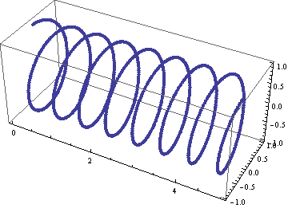

	Plot of spiral :math:`\left(\frac{i}{10},~\sin(i),~\cos(i)\right);~i\in[0,50]`.

We have a 3D-version of :code:`RadialPlot` with :code:`SphericalPlot3D`, where we have
a function :math:`r(\theta,~\phi)` as the radius as a function of angles.

::

	SphericalPlot3D[t p, {t, 0, 2 Pi}, {p, 0, Pi}]

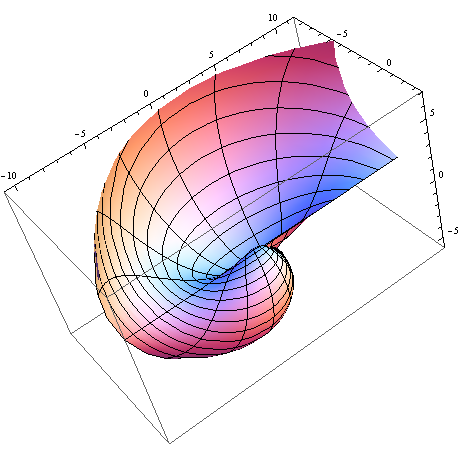

	Plot of :math:`r(\theta,~\phi)=\theta\phi;~\theta\in[0,~2\pi],~\phi\in[0,~\pi]`.

We have two versions of parametric plots in 3D. The first allows for three functions
:math:`x(t),~y(t),~z(t)`, such as:

::

	ParametricPlot3D[{{t, Sin[t], Cos[t]}}, {t, 0, 10},
	  BoxRatios -> Automatic]

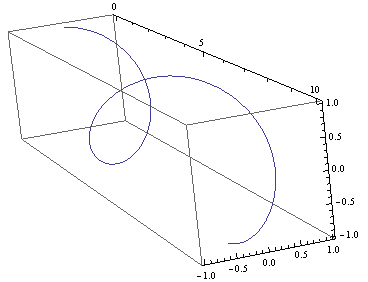

	Plot of :math:`x(t)=t,~y(t)=\sin(t),~z(t)=\cos(t);~t\in[0,~10]`.

But we can also have functions of two variables :math:`x(u,~v),~y(u,~v),~z(u,~v)`:

::

	ParametricPlot3D[{{v, u Sin[v], u Cos[v]}},
	  {u, 8, 10},
	  {v, 0, 8 Pi},
	  BoxRatios -> Automatic,
	  PlotStyle -> Blue]

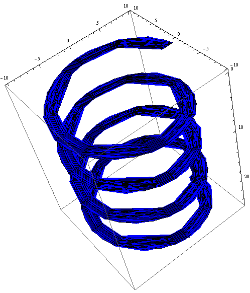

	Plot of :math:`\left(v,~u\sin(v),~u\cos(v)\right);~u\in[8,10],~v\in[0,~8\pi]`.

We have a :code:`RegionPlot` analogue in 3D as well with :code:`RegionPlot3D`.

::

	RegionPlot3D[
	  And[x^2 + y^2 >= 36,
	    x^2 + y^2 + z^2 <= 64],
	  {x, -9, 9},
	  {y, -9, 9},
	  {z, -5, 5},
	  ColorFunction -> "BrightBands"]

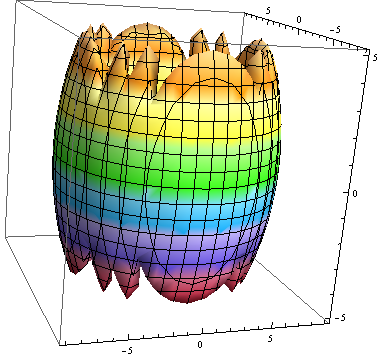

	Plot of the intersection of regions :math:`x^2+y^2\geq36` and
	:math:`x^2+y^2+z^2\leq64`.

We have a plot unique to 3D plots based on the notion of rotating a 2D curve in 3D space. RevolutionPlot3D

Basic "1D" Graphs
-----------------
Histogram, SmoothHistogram

Combining Plots
---------------
Show
