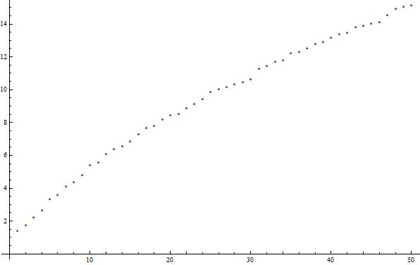

.. raw:: html

   <h1><i>Mathematica</i></h1>

Introduction
============
*Mathematica* is a language and application created by Stephen Wolfram's company, Wolfram Research. As of Fall 2013,
it is in its 9th major version. *Mathematica* is used for a variety of applications and has capabilities for
cluster computing (essentially, having many computers run the same program with different data to solve a problem).

Why *Mathematica*
-----------------
As in most programming languages, you can make the code as general as possible, with a variety of applications,
but in the general case for *Mathematica*, individual programs are written to solve specific problems. As the name suggests,
*Mathematica* is very good at all sorts of mathematical problems, from integrals and derivatives to
3D data plots to statistical analysis and more (for more, see the 
`Wolfram site <http://www.wolfram.com/mathematica/features/application-areas.html>`_). It is a cross-platform application,
meaning that it is available on Windows, Mac, and Linux, and except for special cases, you will need the *Mathematica*
application to do anything using the *Mathematica* language (the CDF format -
essentially an interactive PDF can be viewed without *Mathematica*, but *Mathematica*
it is needed to edit CDFs).

Access
------
If you are a physics student at UT, you can obtain it using a site licence paid for by the university (for Windows, Mac, or Linux). See the
`Physics Department Software Page <https://www.ph.utexas.edu/software/>`_ for more (need UT EID).

Otherwise, if you are a UT student, various computer labs, including the PMCL in RLM have *Mathematica* installed
already. You can also purchase a 1-year license for your own machine
through the `UT Campus Computer Store <http://campuscomputer.com/>`_ (only Windows and Mac) at
a discounted rate (as of January 2014, $35).
If you are not a UT student (just reading this book on your own),
you may need to purchase the software from
`Wolfram <http://www.wolfram.com/mathematica/>`_ (for individuals, as low as $149/year;
for students, as low as $44.95/semester).

Example
-------
Let's say that we want to produce a very simple *Mathematica* document that plots the function
:math:`\sqrt{P_n}` where :math:`P_n` is the :math:`n^{\textrm{th}}` prime number starting at
:math:`P_1=2`, for :math:`n\in[1,50]`.

First, we create the list of square-rooted primes:

::

	sqrtPrimes = Table[Sqrt[Primes[n]], {n,50}]

Then, we can simply plot the list we created with:

::

	ListPlot[sqrtPrimes]

Which gives a result that looks like:

For an even cooler example, we can look at `this post <http://stackoverflow.com/questions/8479058/how-do-i-find-waldo-with-mathematica>`_ from StackOverflow, where users
created a Waldo-finder in *Mathematica* (using techniques we won't discuss):

::

	waldo = Import["waldo.jpg"];
	red = Fold[ImageSubtract, #[[1]], Rest[#]] &@ColorSeparate[waldo];
	corr = ImageCorrelate[red, 
   		Image@Join[ConstantArray[1, {2, 4}], ConstantArray[0, {2, 4}]], 
   		NormalizedSquaredEuclideanDistance];
	pos = Dilation[ColorNegate[Binarize[corr, .12]], DiskMatrix[30]];
	found = ImageMultiply[waldo, 
  		ImageAdd[ColorConvert[pos, "GrayLevel"], .35]]

which takes an image like

and creates

While *Mathematica* may not be the best language for extremely-large scale data processing (although
it has cluster capabilities when coupled with *gridMathematica* which will not be discussed here), the above example hopefully
indicates how easy some tasks can be in the language. We will see later how to do more complicated
input (reading files, etc.) and output (graphs, tables, etc.), as well as incorporate data analysis concepts.

Other Information Sources
-------------------------
Wolfram has a tutorial on the "Core Language" `here <http://www.wolfram.com/learningcenter/tutorialcollection/CoreLanguage/>`__. It is available for purchase in print or free download. It covers many
topics that will be referenced here. Their *Mathematica* site also maintains documentation
of all the built-in parts of the language `here <http://reference.wolfram.com/mathematica/guide/Mathematica.html>`__, which are duplicated in *Mathematica*'s Help menus.
